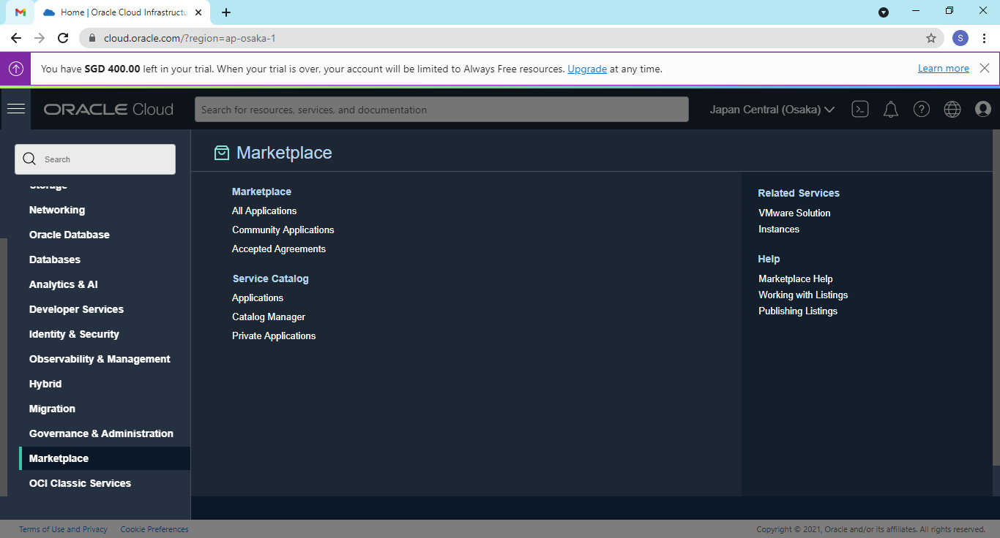
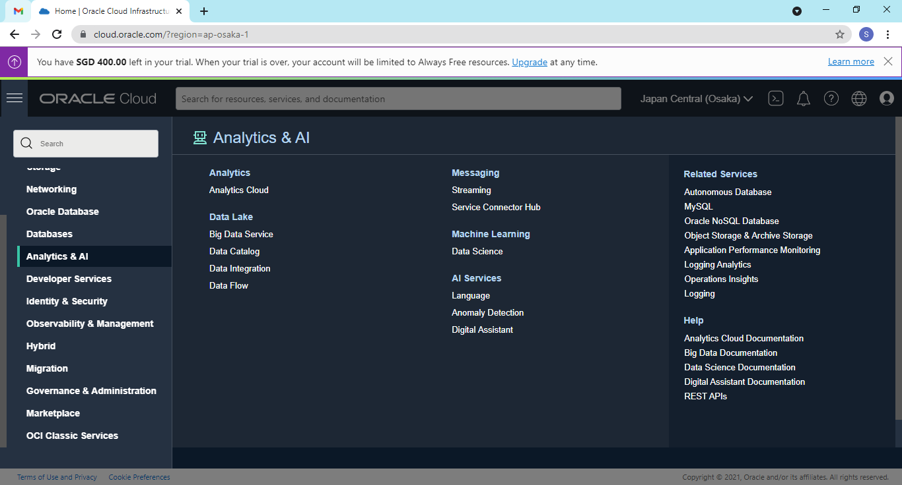

# 02 - Layanan Cloud

## Tujuan Pembelajaran

1. Mengetahui layanan yang ditawarkan cloud computing khususnya Oracle Cloud
Infrastructure (OCI)

## Tugas 5 Layanan Oracle Cloud

### Layanan 1: Marketplace

Oracle Cloud Infrastructure Marketplace adalah toko online yang menawarkan solusi khusus untuk pelanggan Oracle Cloud Infrastructure. Dalam katalog Oracle Cloud Infrastructure Marketplace, Anda dapat menemukan daftar untuk dua jenis solusi dari Oracle dan mitra tepercaya: gambar dan tumpukan. Jenis daftar ini mencakup berbagai kategori aplikasi. Juga, beberapa daftar gratis dan yang lainnya memerlukan pembayaran.

Gambar adalah templat hard drive virtual yang menentukan sistem operasi dan perangkat lunak untuk dijalankan pada sebuah instans. Anda dapat menerapkan daftar gambar pada instance Oracle Cloud Infrastructure Compute. Marketplace juga menawarkan daftar tumpukan. Tumpukan mewakili definisi grup sumber daya Oracle Cloud Infrastructure yang dapat Anda gunakan sebagai grup. Setiap tumpukan memiliki konfigurasi yang terdiri dari satu atau lebih file konfigurasi deklaratif. Dengan gambar atau tumpukan, Anda memiliki cara yang disesuaikan dan lebih ramping untuk memulai dengan perangkat lunak penerbit.

Selain sebagai toko online, Oracle Cloud Infrastructure Marketplace menawarkan cara bagi anggota komunitas Oracle Cloud Infrastructure untuk berbagi gambar kustom dengan anggota komunitas lainnya. Anda dapat mengambil gambar kustom yang Anda impor ke Oracle Cloud Infrastructure Compute dan membuatnya tersedia sebagai aplikasi komunitas. Aplikasi muncul di samping gambar lain yang dapat dipilih pengguna selama proses pembuatan instance.

### Layanan 2: Analytics Cloud

Analytics memberdayakan analis bisnis dan konsumen dengan kemampuan analitik swalayan modern yang didukung AI untuk persiapan data, visualisasi, pelaporan perusahaan, analisis tambahan, dan pemrosesan bahasa alami.

Oracle Analytics Cloud adalah layanan cloud publik yang skalabel dan aman yang menyediakan kemampuan untuk mengeksplorasi dan melakukan analitik kolaboratif untuk Anda, grup kerja, dan perusahaan Anda

Oracle Analytics Cloud tersedia di Oracle Cloud Infrastructure di beberapa wilayah di Amerika Utara, EMEA, APAC, dan LAD saat Anda berlangganan melalui Universal Credits. Anda dapat berlangganan Edisi Profesional atau Edisi Perusahaan.

Saat Anda menerapkan Oracle Analytics Cloud, Anda menyelesaikan beberapa langkah penyiapan awal, lalu Oracle menangani sebagian besar manajemen layanan, patching, pencadangan dan pemulihan, serta tugas pemeliharaan lainnya. Anda menentukan ukuran layanan Anda saat menyiapkan layanan dan Anda dapat menambah atau mengurangi kapasitas jika persyaratan Anda berubah. Oracle Analytics Cloud menawarkan dua opsi ukuran, Anda dapat menentukan jumlah Oracle Compute Units (OCPU) yang ingin Anda gunakan atau berapa banyak orang yang Anda harapkan untuk menggunakan layanan ini.

### Layanan 3: Cloud Shell

Oracle Cloud Infrastructure (OCI) Cloud Shell adalah terminal berbasis browser web yang dapat diakses dari Oracle Cloud Console. Cloud Shell gratis untuk digunakan (dalam batas sewa bulanan), dan menyediakan akses ke shell Linux, dengan Oracle Cloud Infrastructure CLI yang telah diautentikasi sebelumnya, instalasi Ansible yang telah diautentikasi sebelumnya, dan alat berguna lainnya untuk mengikuti tutorial layanan Oracle Cloud Infrastructure dan laboratorium. Cloud Shell adalah fitur yang tersedia untuk semua pengguna OCI, dapat diakses dari Konsol. Cloud Shell Anda akan muncul di Oracle Cloud Console sebagai kerangka Konsol yang tetap, dan akan tetap aktif saat Anda membuka halaman Konsol yang berbeda.

Cloud Shell menyediakan:

1. Mesin ephemeral untuk digunakan sebagai host untuk shell Linux, telah dikonfigurasi sebelumnya dengan versi terbaru dari OCI Command Line Interface (CLI) dan sejumlah alat yang berguna
2. 5GB penyimpanan untuk direktori home Anda
3. Bingkai Konsol yang tetap aktif saat Anda menavigasi ke halaman konsol yang berbeda

Cara Kerja Cloud Shell

Mesin Cloud Shell adalah mesin virtual kecil yang menjalankan shell Bash yang Anda akses melalui OCI Console. Cloud Shell dilengkapi dengan OCI CLI yang telah diautentikasi sebelumnya, disetel ke region halaman beranda penyewa Konsol, serta alat dan utilitas terbaru.

Cloud Shell dilengkapi dengan penyimpanan persisten sebesar 5 GB untuk direktori beranda, sehingga Anda dapat membuat perubahan lokal pada direktori beranda, lalu melanjutkan mengerjakan proyek saat Anda kembali ke Cloud Shell.

Cloud Shell dapat digunakan secara gratis (dalam batas bulanan sewa Anda) dan tidak memerlukan penyiapan atau prasyarat apa pun selain kebijakan IAM yang memberikan akses ke Cloud Shell. Cloud Shell Anda menyertakan VM yang disediakan untuk Anda yang dijalankan dalam sewanya sendiri (sehingga tidak menggunakan sumber daya sewa Anda) dan menghosting shell Anda di OS Oracle Linux saat Anda aktif menggunakan Cloud Shell.

Apa yang Disertakan Dengan Cloud Shell Selain OCI CLI, Cloud Shell VM hadir dengan versi terbaru dari beberapa alat dan utilitas berguna yang telah diinstal sebelumnya, termasuk:
- Git
- Java
- Python (2 dn 3)
- SQL Plus
- kubectl
- Helm
- maven
- gradle
- terraform
- ansible
- Most OCI SKDs, including:
    - Java
    - Phyton
    - Go
    - TypeScript dan JavaScript
    - Ruby

### Layanan 4: Database Migration

Migrasi Database adalah layanan terkelola sepenuhnya yang membantu administrator database memindahkan database secara real-time, dalam skala besar, dari satu atau beberapa database sumber ke database Oracle Cloud. Konfigurasikan, jalankan, dan pantau migrasi database dalam satu antarmuka.

Oracle Cloud Infrastructure Database Migration adalah layanan terkelola sepenuhnya yang memberi Anda pengalaman layanan mandiri berkinerja tinggi untuk memigrasi database ke Oracle Cloud Infrastructure (OCI).

Migrasi Database berjalan sebagai layanan cloud terkelola yang terpisah dari sewa dan sumber daya Anda. Layanan ini beroperasi sebagai layanan multi-penyewa dalam sewa layanan Migrasi Database dan berkomunikasi dengan sumber daya Anda menggunakan Private Endpoints (PEs). PP dikelola oleh Database Migration

Migrasi Database mencakup kemampuan berikut:
- Migrasi data dari database on-premise dan Oracle Cloud ke Autonomous Data Warehouse, atau Autonomous Transaction Processing pada Oracle Cloud Infrastructure,
- Opsi migrasi offline sederhana atau migrasi logis tingkat perusahaan dengan opsi waktu henti minimal
- Berdasarkan replikasi Oracle GoldenGate terkemuka di industri dan didukung oleh mesin Zero Downtime Migration
- Sesuai dengan Oracle Maximum Availability Architecture (MAA) dan mendukung Oracle Database 11g Release 2 (11.2.0.4) dan rilis database yang lebih baru.
- Transisi mulus dari beban awal ke replikasi streaming
- Melakukan pengambilan data perubahan pada database sumber dan mereplikasi perubahan ini ke target
-  pekerjaan memungkinkan Anda melakukan dan mengelola migrasi database dalam skala armada.
- Fungsi jeda dan lanjutkan memungkinkan Anda menjeda dan melanjutkan pekerjaan migrasi jika diperlukan, yang berguna untuk menyesuaikan dengan jendela pemeliharaan, misalnya
- Pengakhiran pekerjaan memungkinkan Anda menghentikan pekerjaan migrasi yang sedang berjalan, daripada menunggu sampai selesai
- Jalankan kembali (melanjutkan) pekerjaan migrasi dari titik kegagalan
- Pekerjaan pra-pemeriksaan untuk tugas migrasi untuk mencegah kesalahan selama migrasi database

Terminologi Migrasi Basis Data
Konsep berikut sangat penting untuk bekerja dengan Migrasi Database.
- Migration
Mewakili operasi migrasi tunggal dan berisi spesifikasi yang harus digunakan untuk menjalankan migrasi. Spesifikasi migrasi mencakup apakah akan melakukan penyalinan data massal atau tidak, dan/atau menangkap perubahan yang sedang berlangsung, dan pilihan database sumber dan target.
- Migration Job
Mewakili eksekusi migrasi aktif atau sebelumnya. Tugas migrasi dibuat secara implisit saat Anda memulai migrasi. Pekerjaan migrasi adalah snapshot dengan informasi runtime tentang migrasi. Anda menggunakan informasi ini untuk mengaudit log dan menyelidiki kegagalan.
- Validation Job
Memvalidasi prasyarat dan konektivitas untuk database sumber dan target, instans Oracle GoldenGate, dan Oracle Data Pump. Pekerjaan validasi dibuat saat Anda mengevaluasi migrasi.
- Registered Database
Mewakili instance database, yang berisi metadata database dan detail koneksi. Aset data dapat memiliki satu atau banyak koneksi untuk menyertakan semua skema dalam database yang perlu dimigrasikan. Basis data terdaftar juga disebut Koneksi di API
- Agent
Berisi detail yang diperlukan untuk membuat koneksi dari Oracle Cloud Infrastructure ke database sumber yang tidak dapat diakses secara langsung di OCI, misalnya, database di wilayah atau penyewaan yang berbeda di OCI, database lokal, atau database cloud yang diinstal secara manual .
- Schema
Konsep organisasi database untuk menampung objek database seperti tabel, tampilan, prosedur tersimpan, dan sebagainya.

### Layanan 5: Security Zones

Zona Keamanan membuat Anda yakin bahwa sumber daya Anda di Oracle Cloud Infrastructure, termasuk sumber daya Compute, Networking, Object Storage, dan Database, mematuhi prinsip keamanan Oracle.

Zona keamanan dikaitkan dengan kompartemen dan resep zona keamanan. Saat Anda membuat dan memperbarui sumber daya di zona keamanan, Oracle Cloud Infrastructure memvalidasi operasi ini terhadap daftar kebijakan yang ditentukan dalam resep zona keamanan. Jika ada kebijakan zona keamanan yang dilanggar, maka operasi akan ditolak.

Misalnya, kebijakan zona keamanan melarang pembuatan ember publik di Penyimpanan Objek. Jika Anda mencoba membuat keranjang publik di zona keamanan yang memiliki kebijakan ini, atau jika Anda mencoba mengubah keranjang penyimpanan yang ada dan menjadikannya publik, Anda akan menerima pesan galat. Demikian pula, Anda tidak dapat memindahkan sumber daya yang ada dari kompartemen standar ke zona keamanan kecuali semua kebijakan terpenuhi.

Secara umum, kebijakan zona keamanan sejalan dengan prinsip-prinsip keamanan berikut:
- Sumber daya tidak dapat dipindahkan dari zona keamanan ke kompartemen standar karena mungkin kurang aman. 
- Data di zona keamanan tidak dapat disalin ke kompartemen standar karena mungkin kurang aman.
- Semua komponen yang diperlukan untuk sumber daya di zona keamanan juga harus ditempatkan di zona keamanan.
- Sumber daya yang tidak berada di zona keamanan mungkin rentan. Misalnya, instance komputasi (Compute) di zona keamanan tidak dapat menggunakan volume boot yang tidak berada di zona keamanan.
- Sumber daya di zona keamanan tidak boleh diakses dari internet publik.
- Sumber daya di zona keamanan harus dienkripsi menggunakan kunci yang dikelola pelanggan.
- Sumber daya di zona keamanan harus dicadangkan secara teratur dan otomatis.
- Sumber daya di zona keamanan hanya boleh menggunakan konfigurasi dan template yang disetujui oleh Oracle.