# 03 - Membuat Virtual Machine

## Tujuan Pembelajaran

1. Mengetahui layanan Oracle Cloud Infrastructure Compute
2. Mampu membuat Virtual Machine (VM) di layanan compute Oracle Cloud

## Hasil Praktikum

### Praktikum : Membuat VM di Oracle Cloud

**Langkah 1 :** Login kedalam akun Oracle Cloud masing-masing 

**Langkah 2 :** Setelah berhasil login dan ada di beranda Oracle Cloud akun Anda, silakan pilih menu di 
pojok kiri atas, lalu pilih menu *Compute > Instances*

**Langkah 3 :** Pilih **Create instance** untuk membuat VM baru. Pada gambar berikut akan tampil nama, status, dll terkait VM yang pernah kita buat. Jika belum ada, berarti VM belum pernah dibuat.

**Langkah 4 :** Kita beri nama VM sesuai dengan keinginan. Misalnya di sini vm-ubuntu. Untuk *compartment* biarkan secara default dan *placement* pastikan *Always Free-eligible* (biasanya secara default sudah terpilih, jadi tidak perlu diatur lagi)

**Langkah 5 :** Pada bagian *Image and shape* silakan atur sistem operasi yang akan kita gunakan, ubah menjadi *Ubuntu* dengan cara klik *Edit*. Untuk bagian shape biarkan saja, secara default biasanya menggunakan *AMD VM.Standard.E2.1.Micro Always Free-eligible* dengan 1 core CPU dan 1 GB RAM. 

Lakukan perubahan sistem operasi dengan klik Change image.

Pilih *Canonical Ubuntu versi 20.04*, lalu klik *Select image*

**Langkah 6 :**  Pada bagian *Networking* biarkan saja pengaturannya. VCN akan dibahas lebih lanjut pada pertemuan berikutnya. Secara default, akses SSH port 21 sudah bisa diakses.

Selanjutnya bagian SSH *keys*, kita perlu klik *Save Private Key* untuk mengunduh *private key* milik kita agar nanti VM bisa diakses.

**Langkah 7 :** Untuk kapasitas disk bisa kita atur sesuai kebutuhan, namun di sini biarkan secara default seperti pada gambar berikut, yaitu disk bervolume 46.6 GB. Langkah terakhir klik **Create** di pojok kiri bawah untuk memulai membuat VM.

Tunggu prosesnya sekitar 2-5 menit sampai tampil status state VM kita adalah running.

Maka tampilan akan seperti dibawah ini ketika VM running

## TUGAS

**Carilah cara agar Anda dapat melakukan SSH ke VM yang baru dibuat berdasarkan praktikum tersebut!**

### Mengkonversi file private key yang dihasilkan dan telah kita unduh saat pembuatan VM sebelumnya

**Langkah 1 :** Membuka PuTTYgen.

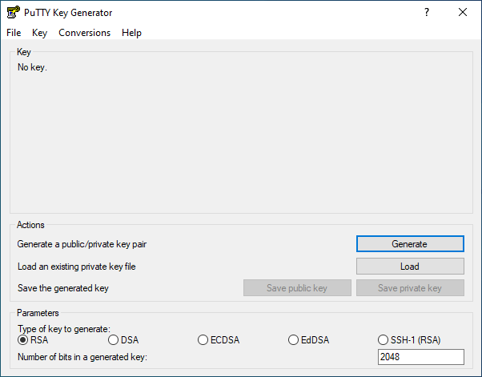

**Langkah 2 :** Klik *Load* dan pilih file private key .key yang sudah kita download sebelumnya 

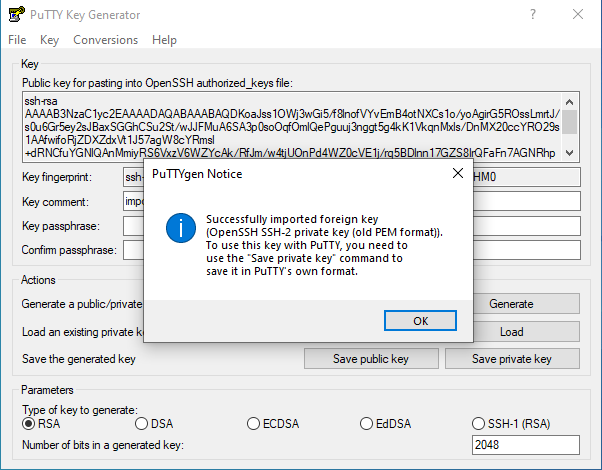

**Langkah 3 :** Kemudian klik *Save Private Key*

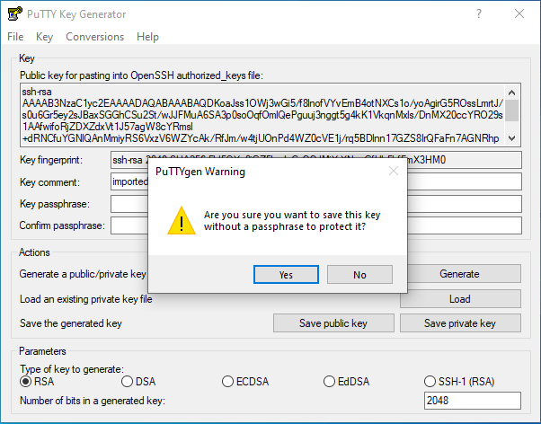

**Langkah 4 :** isi nama untu key tersebut, maka ekstensi untuk private key baru adalah file .ppk

Kemudian klik *Save*

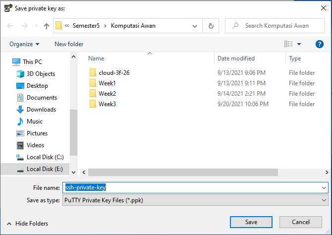

### Menghubungkan ke instace Linux menggunakan private  key

**Langkah 1 :** Buka *PuTTY*

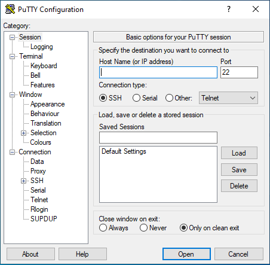

**Langkah 2 :** Pada  *Panel* pilih *Session* dan isikan berikut ini:

- *Host Name (or IP address)* isi dengan *username@Public IP Adrress*,
- *Port* 22, dan
- *Connection Type* pilih yang SSH

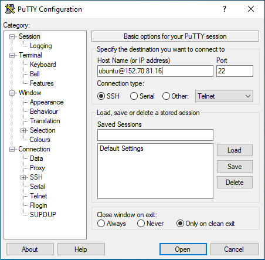

**Langkah 3 :** Pada *Category* expands *Window* dan kemudian pilih *Translation* pada *Remote character set* pilih UTF-8

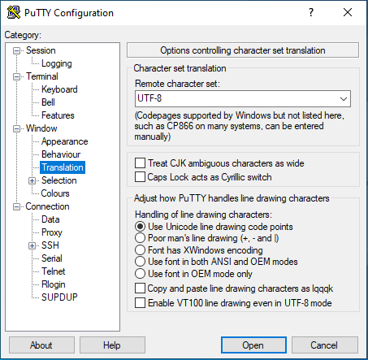

**Langkah 4 :** Pada panel expand *Connection* lalu expands *SSH* dan pilih *Auth*

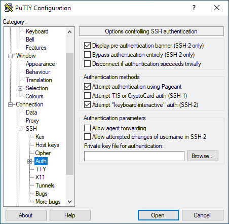

**Langkah 5 :** Lalu klik *Browse*  dan pilih private key .ppk

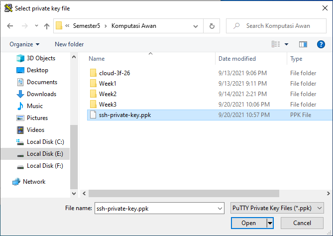

**Langkah 6 :** Kemudian klik mulai sesi

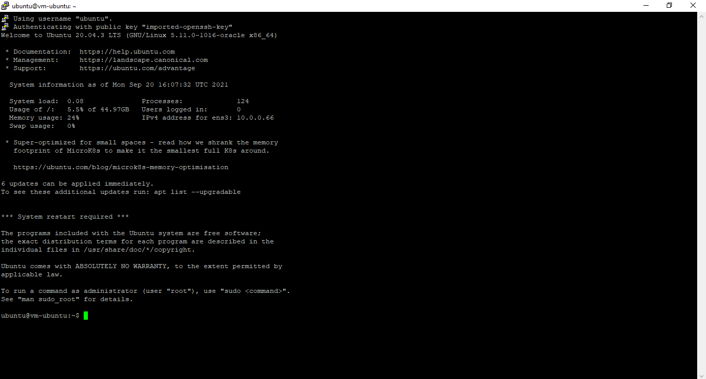

**Langkah 7 :** Untuk menghubungkan ketik *uname -a*

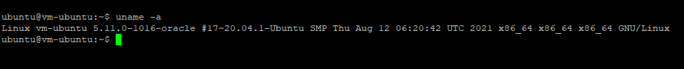