# 05 - PLATFORM AS A SERVICE (PAAS)

## Tujuan Pembelajaran

1. Mengetahui layanan yang ditawarkan cloud computing khususnya Oracle Cloud Infrastructure (OCI)

## Hasil Praktikum

### A.  Membuat Databases

Pada Praktikum PaaS kita tentukan akan menggunakan salah satu layanan PaaS yaitu database. Langkah awal dalam menggunakan salah satu layanan PaaS adalah membuat databases pada OCI. Berikut adalah langkah-langkahnya:

1. Memilih menu Databases MySQL pada OC

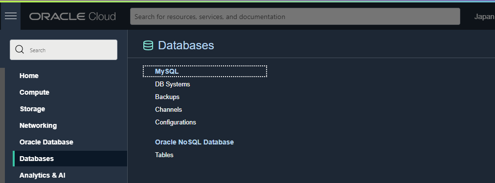

2. Menekan Tombol Create MySQL Database 

3. Mengisi Compartment dan Jenis Database

Pada praktikum ini kita menggunakan standalone databases, karena kebutuhan database kita masih minimal atau tidak memerlukan spesifikasi yang tinggi.

4. Mengisi Data Databases Administrator

Pada database administrator menggunakan username dan password sesuai dengan keinginan atau kebutuhan anda .

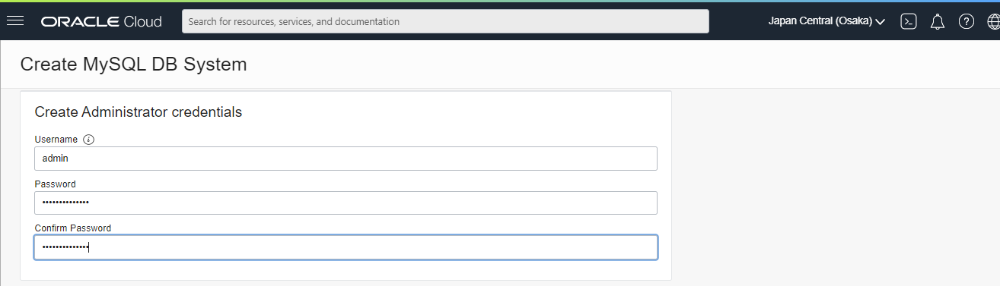

5. Mengkofigurasi VCN 

Konfigurasi VCN pada database disesuaikan dengan tujuan instances yang akan dikoneksikan dengan database

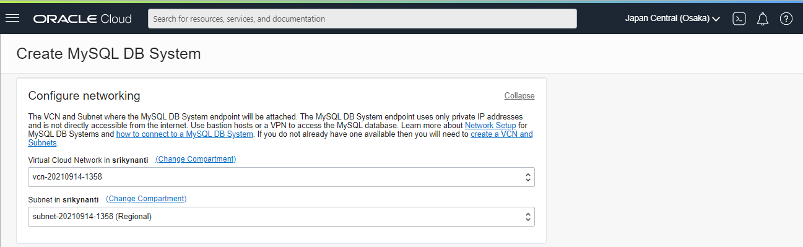

6. Mengkofigurasi Availability Domain 

Untuk Availibility Domain dari database yang akan kita gunakan tidak bisa dipilih pada akun yang gratis, sehingga tidak perlu untuk diubah.

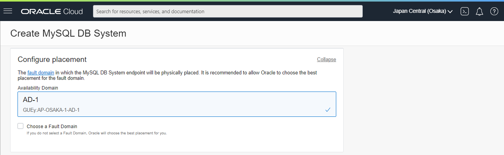

7. Mengkofigurasi Shape dari Database

Pada praktikum ini menggunakan shape yang minimal karena belum memiliki kebutuhan sistem yang memiliki spesifikasi yang tinggi

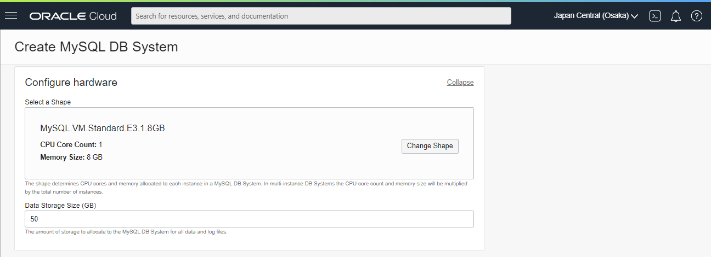

8. Mengkofigurasi Backup dari Database dan Menekan Tomboh Create Database

Untuk backup dari database dapat tidak disetting disesuaikan dengan kebutuhan. Setelah semua pengaturan dianggap telah cukup maka pada tahap akhir adalah menekan tombol create database

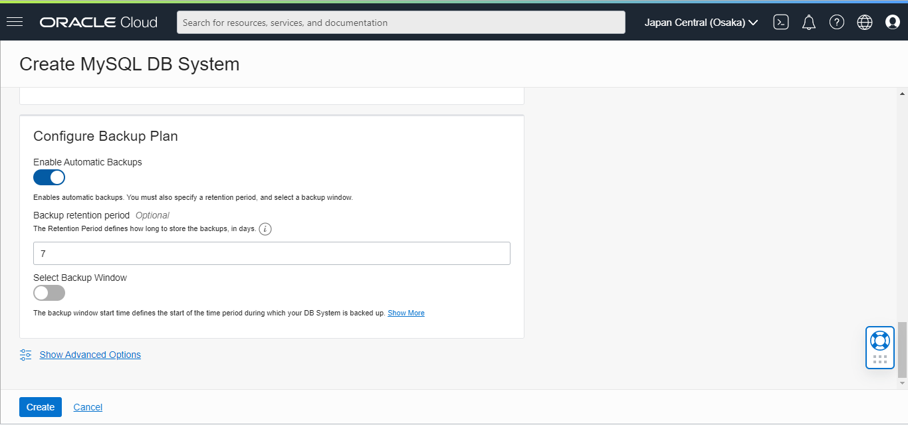

Setelah menekan tombol create database maka status database adalah Creating, jadi tunggulah beberapa saat sampai status database Active

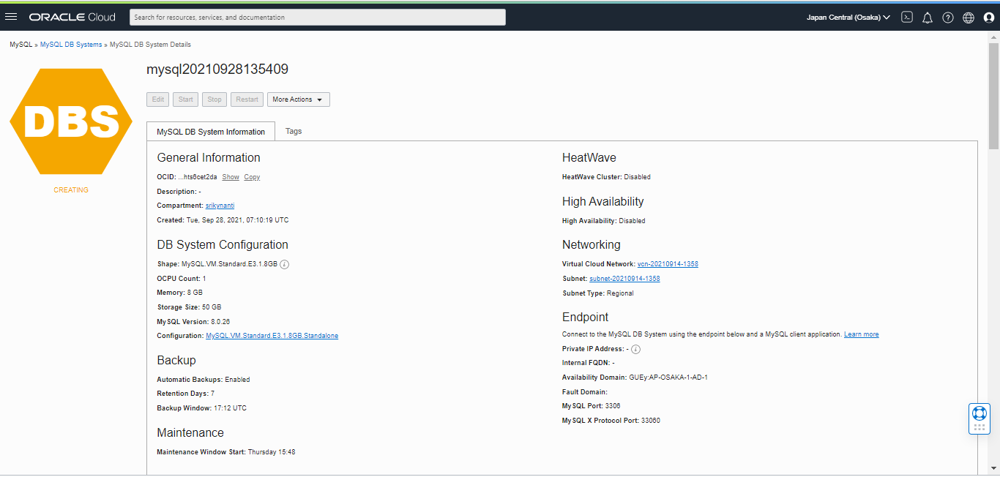

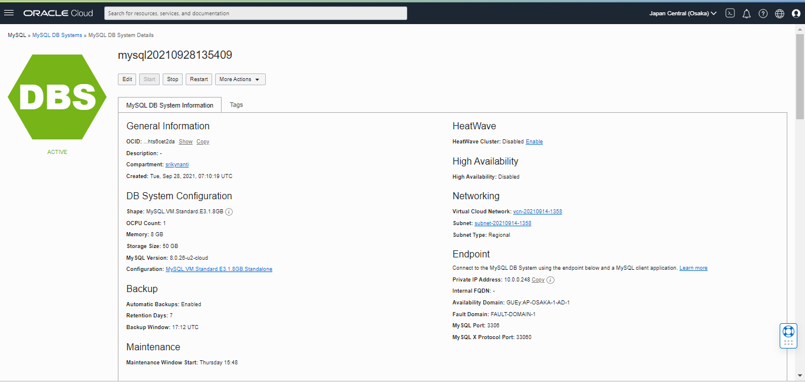

### B. Mengkonfigurasi Virtual Cloud Networks (VCN)

Setelah membuat database pada langkah selanjutnya adalah mengkonfigurasi VCN karena Endpoint dari database bersifat private. Langkah-langkah yang dilakukan adalah sebagai berikut:

1. Memilih menu VCN pada Networking

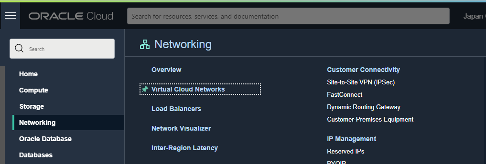

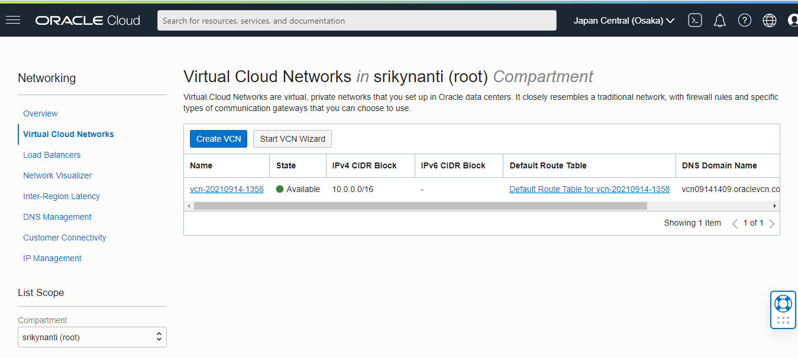

2. Memilih menu Security List

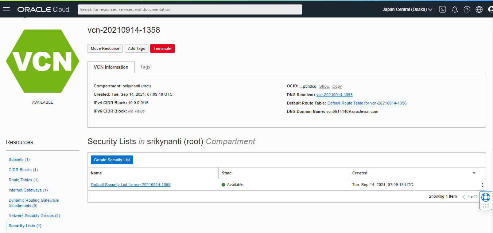

3. Menambah Rules pada Security List

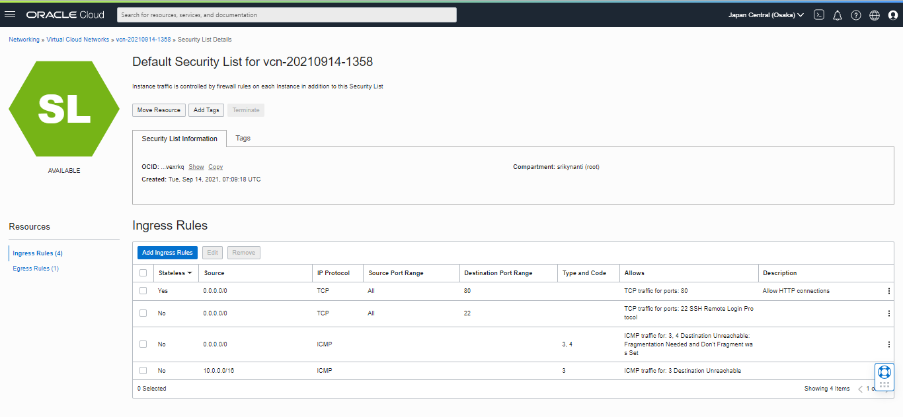

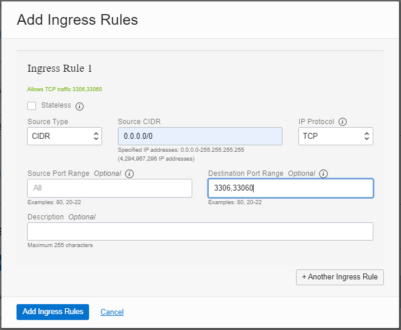

### C. Mengakses MySQL dari Melalui SSH

Untuk mengakses mysql yang telah buat dengan cara sebagai berikut:

1. Cara untuk mengakses instances yang dimiliki melalui ssh adalah dengan mengetik perintah sudo ssh -I <path private key> username@ip public. Contoh penggunaan perintah tersebut adalah 
adalah sebagai berikut:

2.  Mengakses MySQL

Setelah berhasil masuk ke instances yang dimiliki anda dapat mengakses mysql anda akan tetapi anda harus menginstall mysql client. Jika anda tidak memiliki mysql client maka anda akan 
mendapat pesan seperti berikut:

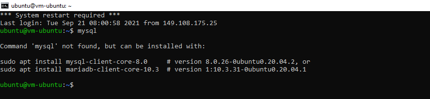

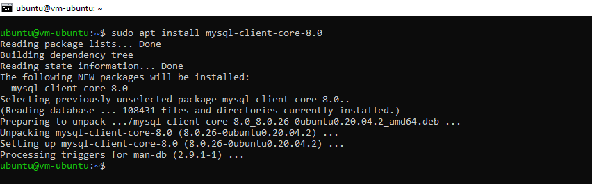

Untuk mengkoneksikan mysql dengan perintah berikut mysql -u <database administrator> -p -h <ip private mysql oci /hostname>. Setelah ini database sudah siap untuk digunakan sesuai dengan kebutuhan anda

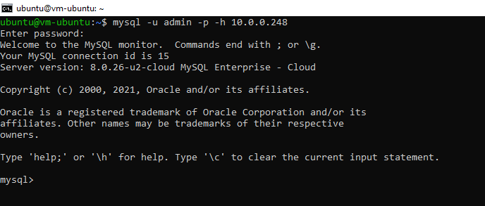

## Tugas