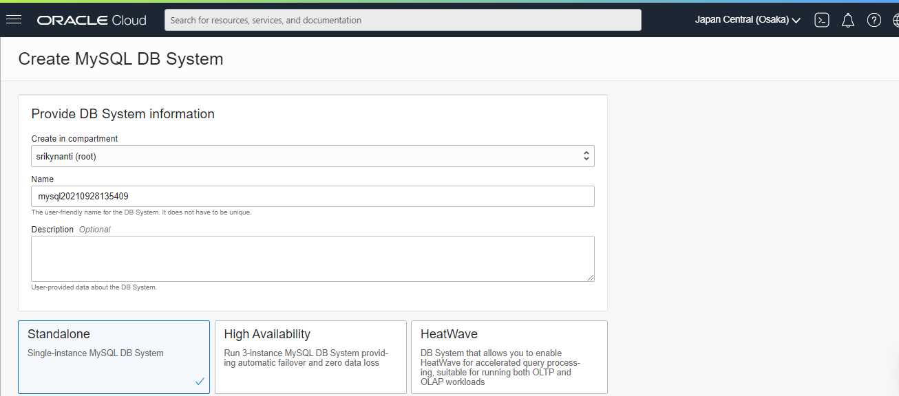

# 05 - PLATFORM AS A SERVICE (PAAS)

## Tujuan Pembelajaran

1. Mengetahui layanan yang ditawarkan cloud computing khususnya Oracle Cloud Infrastructure (OCI)

## Hasil Praktikum

PaaS adalah pendekatan evolusioner untuk memberikan middleware dan kapasitas database yang

## Tugas