# Install Wordpress Pada PaaS

Cara untuk menginstall wordpress pada OCI dapat menggunakan langkah-langkah seperti berikut:

1. Mengakses instances yang dimiliki melalui ssh adalah dengan mengetik perintah sudo ssh -I <path private key> username@ip public. Contoh penggunaan perintah tersebut adalah 
adalah sebagai berikut:

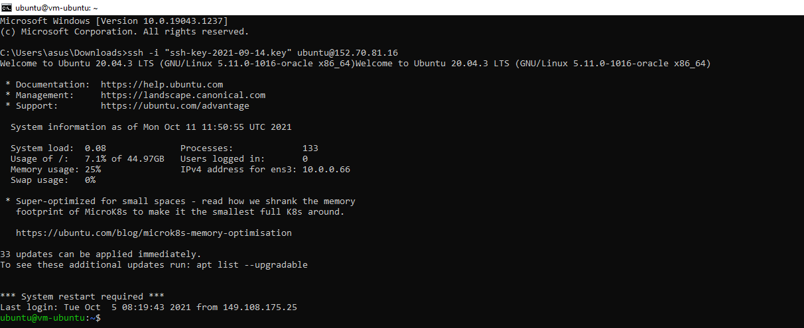

2.  Mengakses MySQL

Untuk mengkoneksikan mysql dengan perintah berikut mysql -u <database administrator> -p -h <ip private mysql oci /hostname>. Setelah ini database sudah siap untuk digunakan sesuai dengan kebutuhan anda

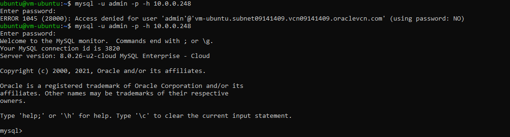

3. Membuat Database

Cara untuk membuat database pada mysql adalah dengan mengetik perintah di bawah ini.Perintah pertama untuk membuat database, perintah kedua untuk melihat apakah database kita sudah berhasil dibuat dan ketiga adalah memberikan previleges database pada user admin. Anda dapat membuat 
user baru dan mengatur previlegenya.

mysql> create database wordpress;
mysql> show databases;
mysql> grant all privileges on wordpress.* to admin;

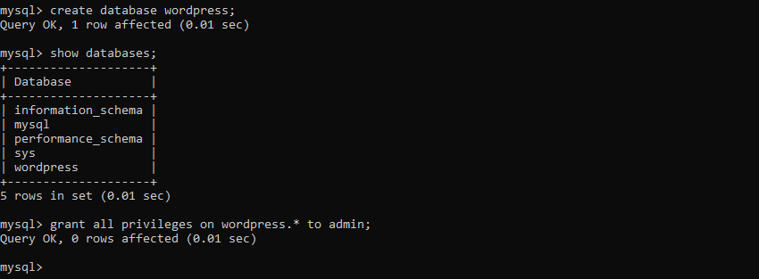

2. Download Wordpress Pada Folder /var/www/html dengan perintah

wget https://wordpress.org/latest.tar.gz;

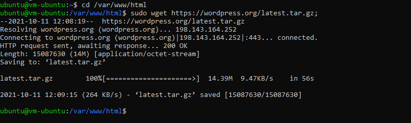

3. Mengetrak Wordpress Pada Folder /var/www/html dengan perintah

tar zxvf latest.tar.gz

Selanjutnya setelah estrak file hasil download dapat dihapus dengan menggunakan perintah

sudo rm rf latest.tar.gz

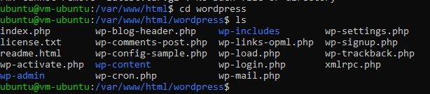

4. Selanjutnya menginstall extension mysql pada php dan mengaktifkannya pada php.ini

Berikut adalah perintah untuk menginstall extenstion mysql pada php

sudo apt-get install php-mysql

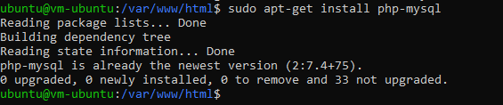

Sedangkan cara untuk mengaktifkan extension mysql pada php dapat diaktifkan pada php.ini. Path dari php.ini dapat dilihat pada phpinfo() seperti pada gambar berikut terletah pada /etc/php/7.4/apache2/php.ini

Pada php.ini aktifkan extension=php_mysqli.dll kemudian lakukan restart apache menggunakan perintah berikut.

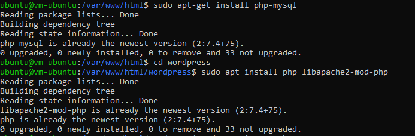

sudo service apache2 restart
sudo chown www-data:www-data -R *

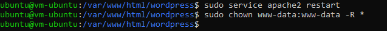

5. Selanjutnya Proses Intalasi Wordpress Melalui Browser

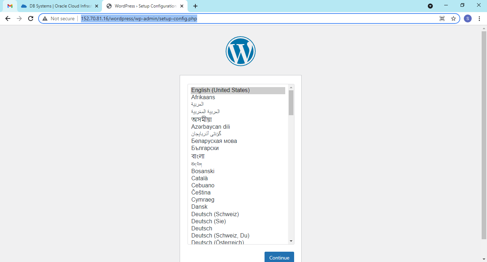

Masukkan data-data yang digunakan untuk membuat tabel

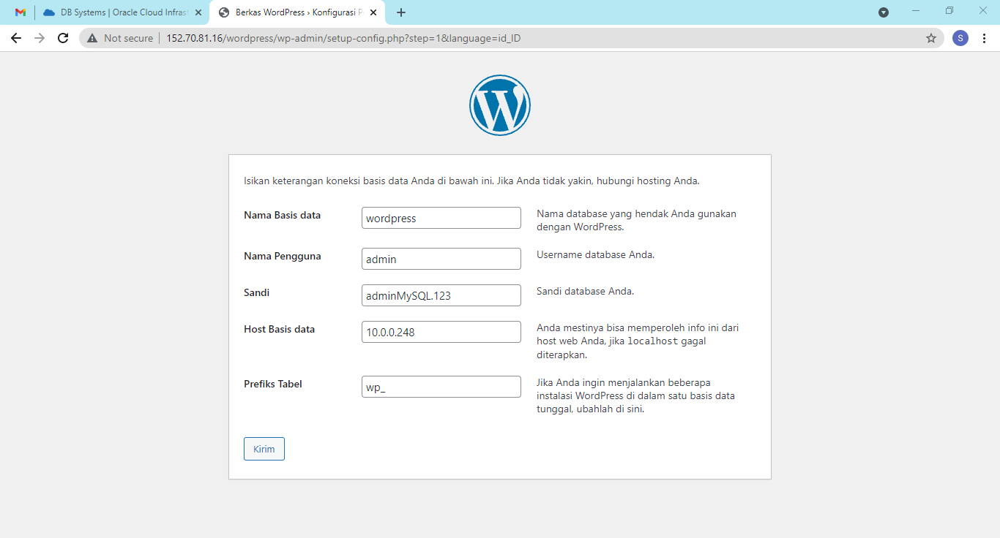

Copy teks dibawah ini

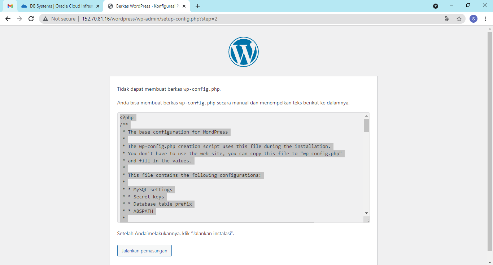

Buat file dengan nama wp-config.php

Paste teks yang sudah dicopy tadi dan klik run the installation pada browser

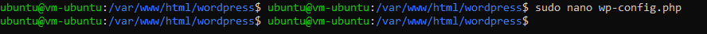

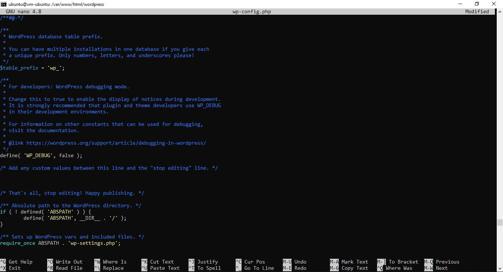

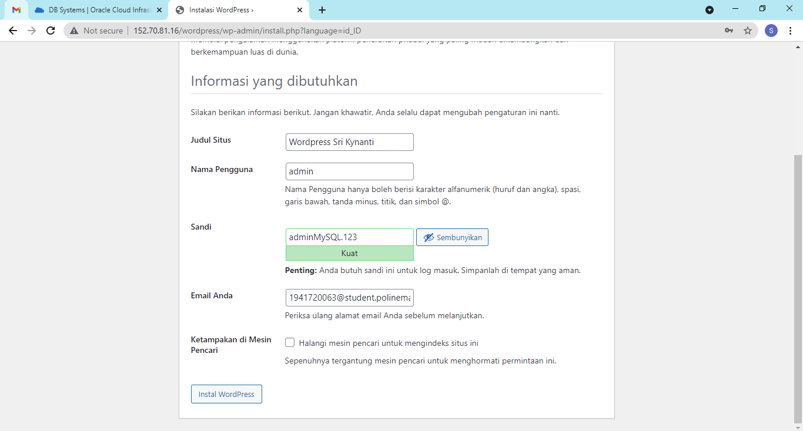

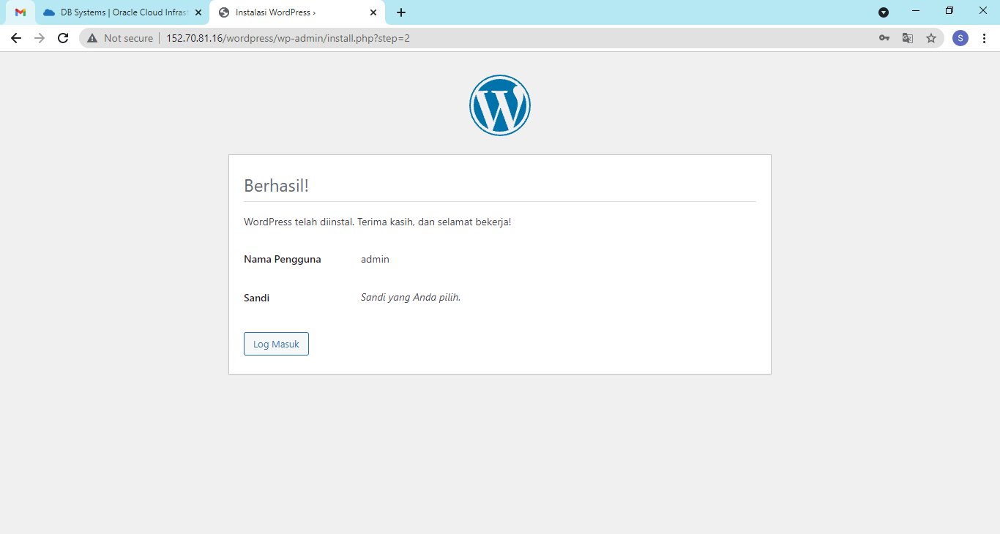

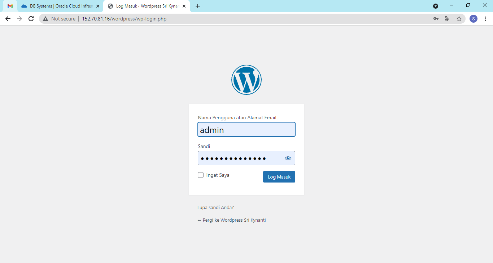

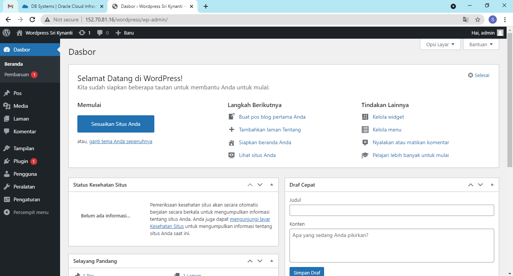

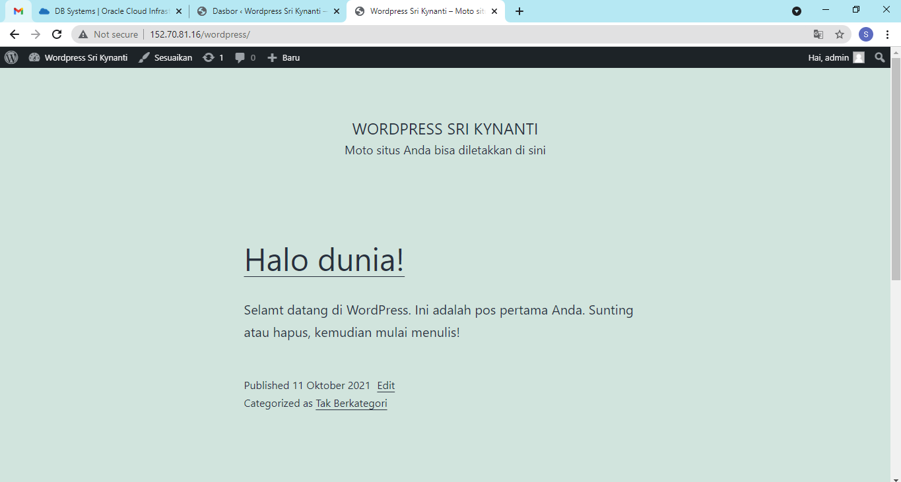