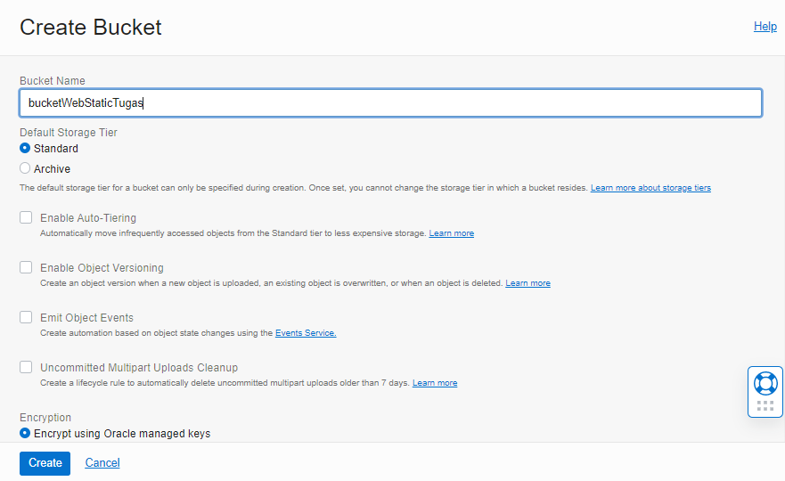
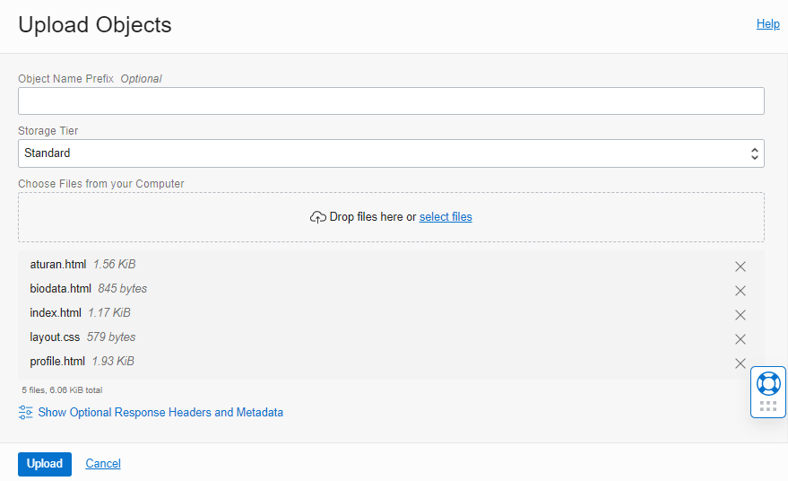
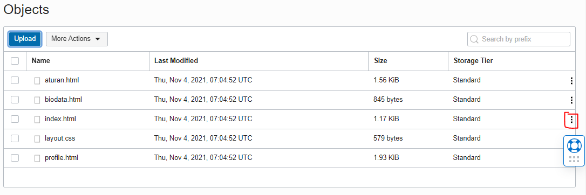
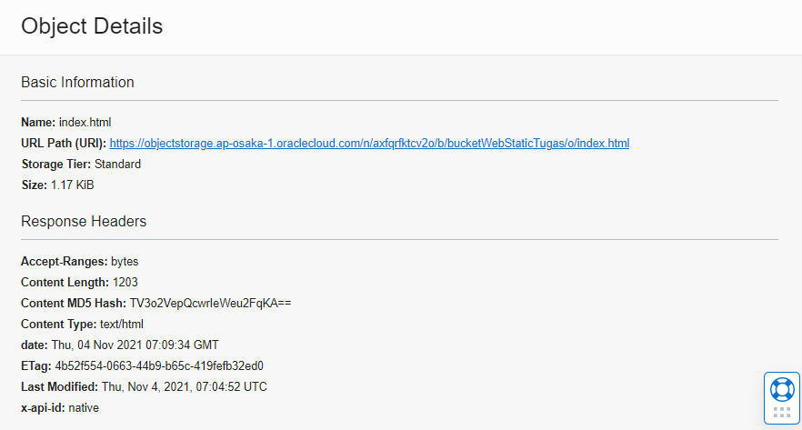

# 08.  Object Storage

## Hasl Praktikum

Pada praktikum kali ini kita akan membuat static website kemudian menghostingnya ke Oracle Object Storage. OCI memiliki free tier, salah satunya adalah object storage yang bia digunakan untuk menyimpan file an berrjalan pada protokol https.

1. Membuat bucket untuk website. Sign-in ke OCI kemudian pilih Object Storage.

Create Bucket -> Pilih standar bucket

Untuk free tier mendapatkan gratis 10 GB Object Storage da 10 GB archive storage (jika penggunaan lebih dari 20 GB dan tidak melakukan upgrade dari free trial maka otomatis datat akan dihapus)

(Bucket Name -> bebas)

Buka bucket dengan melakukan klik pada nama bucket kemudian pilih Edit Visibility. Pilih Vsibility menjadi Public. Tekan Save Changes untuk menyimpan perubahan.

2. Uploading web page. Pada bagian bawah dari Bucket Information trdapat box Object (upload semua file yang ada pada folder colorFiper)

Setelah upload index.html file -> Klik titik 3 pada sisi kiri file index.html

Kemudian pilih View Object detail (Panel detail akan menunjukkan detail URL object)

Kemudian pilih URL Path(URL untuk mmbuka file)

Jika file yang diupload berhasil tampilan pada halaman akan seperti pada gambar dbawah ini:

## Tugas

1. Buatlah laporan dan dokumentasi dari praktikum yang andaa lakukan.
2. Carilaah aplikasi web static kemudian upload ke Object Storage yang telah anda buat

    - Create Bucket dengan nama WebStatis → Pilih standar bucket

        

    - Buka bucket dengan melakukan klik pada nama bucket kemudian pilih Edit Visibility. Pilih Visibility menjadi Public. Tekan Save Changes untuk menyimpan perubahan.

        

    - Uploading web page. Pada bagian bawah dari Bucket Information terdapat box Object (upload semua file yang ada pada folder portofoliobootstrap-1-master)

        

    - Setelah upload index.html file → Klik titik 3 pada sisi kiri file index.html.

        

    - Kemudian pilih View Object Detail (Panel detail akan menunjukkan detail URL objek)

        

    - Kemudian pilih URL Path (URI) untuk membuka file

        

    - Jika file yang di upload berhasil tampilan pada halaman akan seperti pada gambar di bawah ini:

        