# 10. Docker

## Tujuan Praktikum
1. Mengemas aplikasi dengan semua dependensi yang dibutuhkannya ke dalam sebuah standar untuk deployment
2. Docker membungkus semuanya menjadi sistem file lengkap yang berisi semuanya kebutuhan aplikasi dan yang menjalankan  mesin virtual itu sendiri.
3. Proses packaging tersebut ke dalam sebuah image lengkap dan menjamin bahwa itu portable, ketika menjalankan dilakukan dengan cara yang sama, tidak memperdulikan environment deployment yang digunakan.

## Praktikum
1. Install Docker

    Agar dapat menjalankan container maka diperlukan installasi docker di host, docker sudah support beberapa sistem operasi seperti windows ataupun keluarganya unix. Pada praktikum kali ini akan dilakukan installasi pada Oracle Cloud. Untuk proses installasi silakan mengikuti langkah-langkah di bawah ini

    - Silakan masuk ke virtual mesin Anda kemudian jalankan perintah di bawah ini

        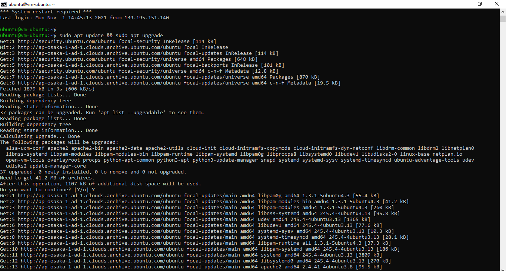

        Tunggu beberapa saat sampai proses update selesai, jika ada dialog yang menginfokan untuk dilakukan upgrade silakan dijawab dengan ‘y’.

    - Install paket yang dibutuhkan sebelum melakukan installasi docker, jalankan perintah di bawah ini

        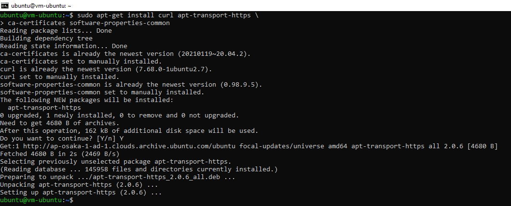

    - Langkah selanjutnya yaitu menambahkan repository docker, dengan beberapa baris perintah di bawah ini

        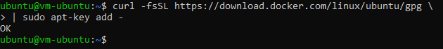

        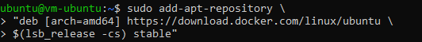

        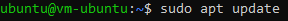

        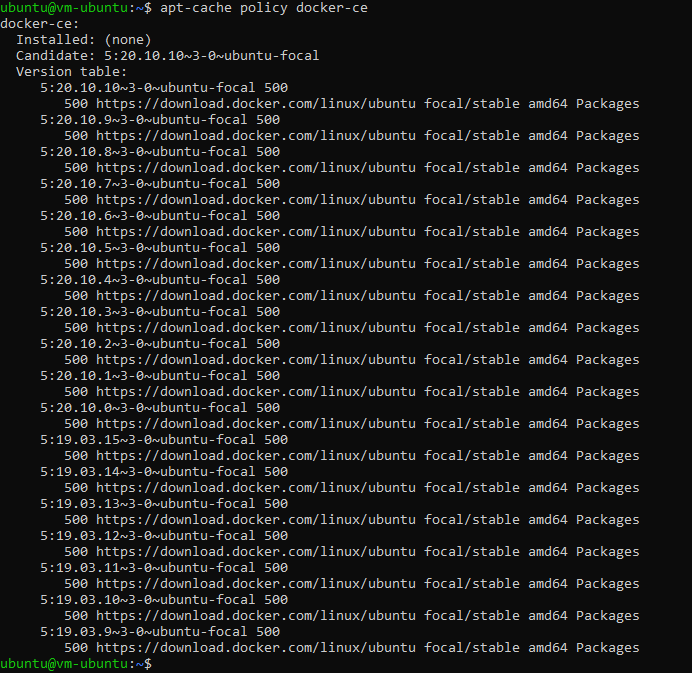

        Jika kita lihat output dari perintah terakhir menandakan bahwa docker belum terinstall dan sudah ada di repository untuk siap dilakukan installasi.
    - Silakan lakukan installasi menggunakan perintah berikut ini

        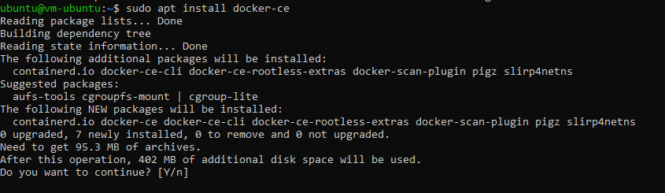

        Ketika progress installasi sudah selesai, kemudian cek apakah docker daemon sudah jalan menggunakan perintah systemctl.

        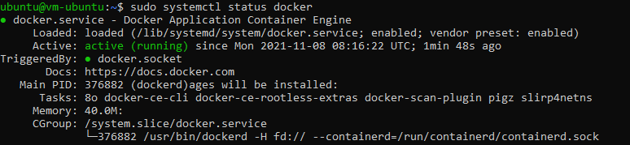

        Jika menampilkan status active (running), berarti docker daemon sudah berjalan.

    - Untuk memastikan kembali, kita butuhmenggunakan image test apakah docker benarbenar berjalan sebagaimana semestinya. Gunakan perintah di bawah ini

        

        Selamat sudah berhasil melakukan installasi docker dan siap untuk digunakan.

    Jika kita perhatikan perintah-perintah di atas, untuk menjalankan docker harus menggunakan sudo, sedangkan terkadang semua pengguna memiliki image masing-masing. Untuk menjalankan perintah docker tanpa menggunakan sudo, berikut ini perintahnya.

    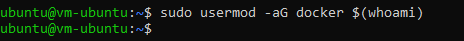

    Agar memberikan perubahan, logout terlebih dahulu kemudian login kembali. Jalankan perintah docker tanpa menggunakan sudo seperti berikut

    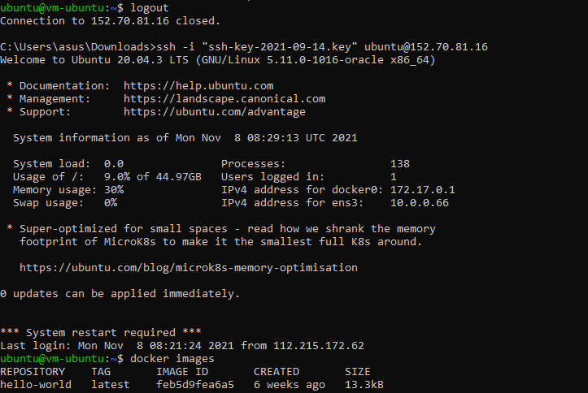

2. Membuat Container

    Ketika kita mengembangkan aplikasi web tentunya membutuhkan sebuah web server, hal yang sering dilakukan dengan melakukan installasi paket tersebut diikuti dengan Langkah-langkah yang lain. Dengan docker, kita cukup satu baris perintah apache sudah bisa berjalan. Berikut ini perintahnya

    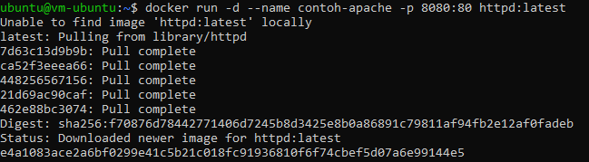

    Perintah di atas digunakan untuk membuat container dengan nama contoh-apache dengan mengexpose port 8080 dari port defaultnya 80, sedangkan image yang digunakan adalah httpd yang merupakan layanan web server apache. Parameter -d digunakan untuk menjalankan containersecara background. Silakan cek menggunakan telnet seharusnya sudah bisa terhubung seperti pada gambar berikut

    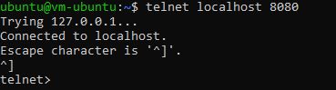

    Agar port 8080 dapat diakses dari luar, tentunya Anda harus mengkonfigurasi terlebih dahulu firewall di Cloud Oracle-nya.

3. Membuat Akun Docker Hub

    Pada praktikum yang kedua kita telah memanfaatkan docker untuk menjalankan web server apache, image yang digunakan adalah httpd dengan versi yang terbaru(latest). Ketika kita membutuhkan sebuah image yang spesifik kebutuhan kita tentunya tidak akan menemukan, hal tersebut dapat menjadi alasan agar kita bisa mendefinisikan image sesuai dengan kebutuhan dan dapat digunakan oleh orang lain. Setelah membuat image kita perlu menyimpan image tersebut pada sebuah repository, yaitu docker hub.

    - Silakan menuju halaman https://hub.docker.com/signup, akan memuat halaman berikut

    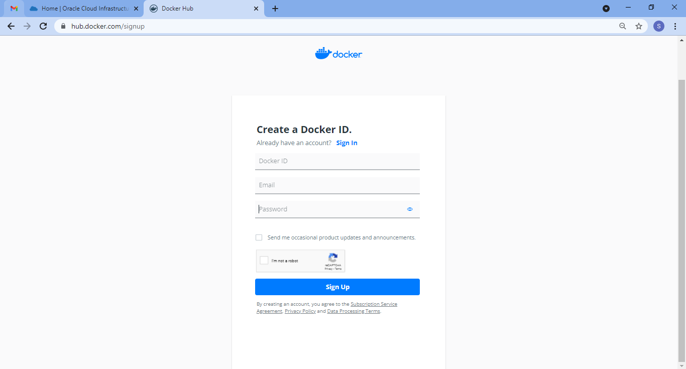

    - Isikan data-data yang dibutuhkan seperti docker id, email, dan password. Jika telah berhasil melakukan halaman pendaftaraan. Untuk melaukan login halamannya adalah sebagai berikut.

    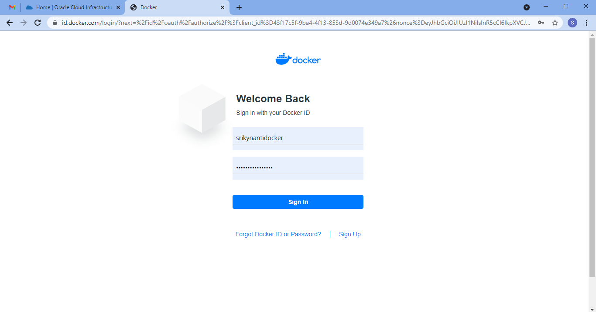

    - Kemudian Anda bisa melihat repository yang telah Anda buat sebelumnya, jika telah membuat. Sebagai contoh seperti berikut

    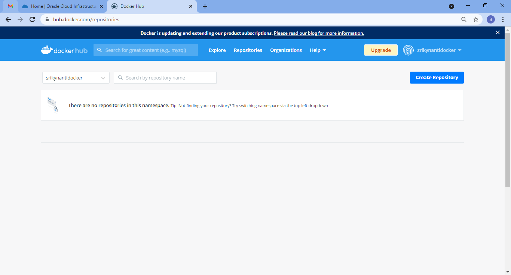

        Dari gambar di atas terlihat bahwa nama repository yang telah kita buat, terdapat juga informasi berapa kali dilakukan download.

4. Build Image

    Sebelumnya kita telah membuat akun di docker hub untuk menyimpan image yang kita buat, kita siapkan aplikasi dan konfigurasi docker dengan langkah-langkah sebagai berikut

    - Clone project yang terdapat di https://gitlab.com/0d3ng/cloud-docker-java-sample.git

    

    - masuk ke dalam direktori tersebut dan jalankan perintah build seperti berikut

    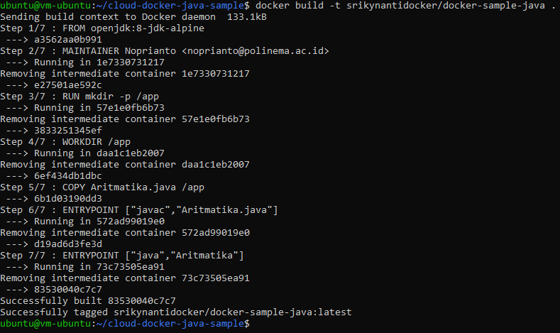

    - Perintah di atas berarti untuk build image dengan tag “0d3ng/docker-sample-java”, silakan diganti nama Anda masing-masing. Jika sudah jalankan container menggunakan image yang telah Anda buat menggunakan perintah berikut.

    - Jika berhasil, maka akan menampilkan string “Hello docker. :)”

    Jika kita ingin upload ke docker hub kita, silakan login dulu menggunakan perintah di bawah ini

    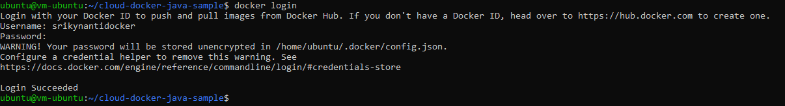

    Selanjutnya kita upload image yang telah kita buat menggunakan perintah di bawah ini

    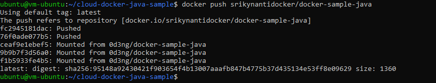

    Silakan cek docker hub Anda

    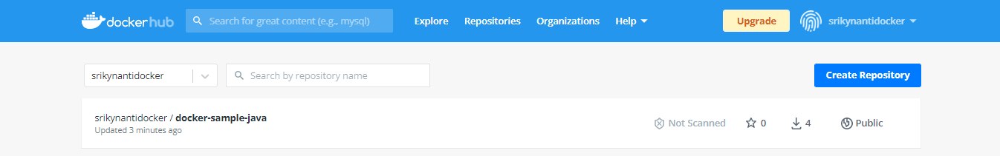

## Tugas
1. Buatlah laporan dan dokumentasi dari praktikum yang Anda lakukan.
2. Silakan build image aplikasi Anda sendiri kemudian jalankan di Oracle Cloud