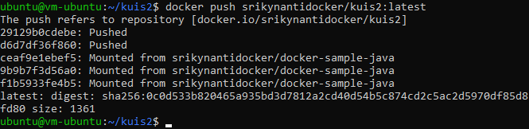

# KUIS 2 KOMPUTASI AWAN

1. Build image dari project UTS

    - Membuat direktori untuk project

        

    - Masuk ke direktori project

        

    - Membuat class java

        

    - Menambahkan script di bawah ini dalam file project.java

        

    - Membuat file dengan nama Dockerfile

        

    - Menambahkan script di bawah ini di dalam file Dockerfile

        

    - Build DockerFile tersebut menjadi sebuah images

        

    - Docker images

        

    - Menjalankan container menggunakan image yang telah di buat

        

    - Meng-upload project ke docker hub

        

    - Selanjutnya upload image yang telah di buat menggunakan perintah di bawah ini

        

    - Melakukan cek repository pada docker hub

        

2. Mengclone dari Repo UTS

    - Clone project github

        

    - Membuat class java

        

    - Tambahkan script di bawah ini dalam file project.java

        

    - Membuat file dengan nama Dockerfile

        

    - Tambahkan script di bawah ini di dalam file Dockerfile

        

    - Build Dockerfile tersebut menjadi sebuah images

        

    - Docker images

        

    - Menjalankan container menggunakan image yang telah di buat

        

    - Meng-upload project ke docker hub

        

    - Selanjutnya upload image yang telah di buat menggunakan perintah di bawah ini

        

    - Melakukan cek repository pada docker hub

        